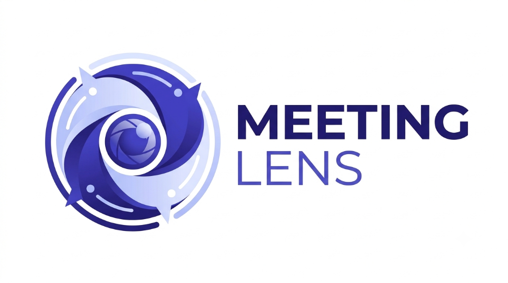

# 👁️ MeetingLens (AI MOM, Task Delegation & Meeting Intelligence System)

<p align="center">
  
</p>

<p align="center">
  <a href="https://drive.google.com/drive/folders/1wBP0v-pzmBOgUdyrPiJ8Yr8vwhN4W-9u?usp=drive_link">
    
  </a>
</p>


---

## 🚀 **PROJECT MEDIA, WORKFLOW VIDEOS & PRESENTATION ASSETS**

> ### 📂 **[CLICK HERE TO ACCESS GOOGLE DRIVE PROJECT REPOSITORY](https://drive.google.com/drive/folders/1wBP0v-pzmBOgUdyrPiJ8Yr8vwhN4W-9u?usp=drive_link)**
> 
> **The Google Drive folder contains all verified project demonstration assets:**
> - 🎥 **Workflow Video Recordings:** Complete step-by-step video demonstrations of voice meetings, live AI transcription, task extraction, human-in-the-loop task approval, and report generation.
> - 📊 **Project Presentation Deck:** Full 10-slide comprehensive deck available in **PowerPoint (`.pptx`)** and **PDF (`.pdf`)** formats.
> - 📐 **Draw.io Flowcharts & Architecture Diagrams:** Editable `.drawio` source diagram files and visual blueprints.

---

## 📌 Overview

**MeetingLens** is an enterprise-grade AI-powered web platform designed to streamline voice meetings, automate Minutes of Meeting (MOM) creation, intelligently extract action items with confidence scoring, and seamlessly delegate tasks via automated emails and calendar integrations.

---

## 📊 Project Presentation & Diagrams Quick Access

| Asset | Description | Direct File Link |
| :--- | :--- | :--- |
| **Google Drive Assets** | **All Video Recordings, Slides & Assets** | **[Google Drive Folder Link](https://drive.google.com/drive/folders/1wBP0v-pzmBOgUdyrPiJ8Yr8vwhN4W-9u?usp=drive_link)** |
| **PowerPoint Presentation** | 10-Slide Full Presentation Deck | [`MeetingLens_Presentation.pptx`](./MeetingLens_Presentation.pptx) |
| **Presentation PDF** | Printable PDF Slide Deck | [`MeetingLens_Presentation.pdf`](./MeetingLens_Presentation.pdf) |
| **Interactive HTML Slides** | In-Browser Slide Viewer | [`MeetingLens_Presentation.html`](./MeetingLens_Presentation.html) |
| **End-to-End Flowchart** | Draw.io Native Editable Flowchart | [`MeetingLens_Flowchart.drawio`](./MeetingLens_Flowchart.drawio) |
| **System Architecture** | Draw.io 4-Tier Architecture Diagram | [`MeetingLens_Architecture.drawio`](./MeetingLens_Architecture.drawio) |

---

## 🌟 Key Features

### 1. Live Voice Meetings & Real-Time Transcription
- In-browser live speech recognition via the **Web Speech API** and **MediaRecorder API**.
- Real-time rolling transcript preview with pause, resume, and instant buffer persistence.

### 2. AI MOM & Action Item Generation
- Powered by **Google Gemini AI** with strict structured JSON schema extraction.
- Generates Executive Summaries, detailed discussion points, formal decisions, and actionable tasks.
- Evaluates meeting health and efficiency with automated **Meeting Quality Scoring (0–100%)**.

### 3. Human-in-the-Loop Task Approval & Delegation
- Interactive review matrix allowing hosts to verify, edit assignees, adjust deadlines, and set urgency priority before database commit.
- Dispatches automated email notifications to assignees with calendar event links and MOM summaries.

### 4. Advanced Analytics & PDF Reports Hub
- Interactive analytics covering team productivity, task distribution, and meeting frequency.
- One-click export of structured MOM reports in PDF, Markdown, and JSON formats.

### 5. Multi-User Authentication & Profile Management
- Secure user registration, JWT/session authentication, Google OAuth single sign-on.
- OTP email verification system for forgotten password retrieval.

---

## 🏗️ 4-Tier System Architecture

```text
+-------------------------------------------------------------------------+
|                  1. CLIENT LAYER (React 18 SPA + Vite)                  |
|  - Live Voice Meeting Room (Web Speech API)                             |
|  - Meeting Details & Smart Transcript Viewer                            |
|  - Human-in-the-Loop Task Approval Modal                                |
|  - Analytics, Quality Scoring & Report Hub                              |
+-------------------------------------------------------------------------+
                                    |
                                    | REST / JSON over HTTPS
                                    v
+-------------------------------------------------------------------------+
|                 2. API GATEWAY LAYER (PHP 8.x REST API)                 |
|  - JWT Authentication & Session Guard                                   |
|  - /api/meetings (CRUD, History & Transcripts)                          |
|  - /api/analyze (NLP Orchestration & Prompt Builder)                    |
|  - /api/action-items (Task State, Assignment & Approval)                |
+-------------------------------------------------------------------------+
                    |                                   |
                    | Prompt / JSON Payloads            | PDO Transactions
                    v                                   v
+------------------------------------+ +----------------------------------+
|   3. INTELLIGENCE & SERVICES       | |      4. PERSISTENCE LAYER        |
|  - Google Gemini AI (LLM Core)     | |         (MySQL InnoDB)           |
|  - Regex JSON Sanitizer & Fallback | |  - users (Auth, Roles)           |
|  - SMTP Email Notification Engine  | |  - meetings (Transcripts, MOM)   |
|  - Speech-to-Text Processing       | |  - action_items (Tasks, Status)  |
+------------------------------------+ +----------------------------------+
```

---

## 📂 Project Structure

```text
MeetingLens/
├── backend/                              # PHP REST API Backend
│   ├── api/                              # API Endpoints
│   │   ├── action-items/                 # Task management & CRUD operations
│   │   ├── analyze/                      # AI processing & Gemini prompt engine
│   │   ├── decisions/                    # Meeting decisions handling
│   │   ├── documents/                    # PDF generation & document retrieval
│   │   ├── email/                        # Email dispatch & notifications
│   │   ├── meetings/                     # Meeting sessions CRUD
│   │   ├── reports/                      # Analytics & statistics generation
│   │   └── users/                        # Auth, profile, OTP reset, social login
│   ├── config/                           # DB, Mailer & AI credentials
│   ├── lib/                              # External libraries (PHPMailer, FPDF)
│   └── uploads/                          # Storage for uploaded files and PDFs
│
├── my-react-app/                         # React.js Frontend (Vite)
│   ├── public/                           # Static assets & logo icons
│   ├── src/
│   │   ├── components/                   # Reusable UI components (Modals, Nav, Sidebar)
│   │   ├── pages/                        # Application Views
│   │   │   ├── Auth.jsx                  # Login & Registration
│   │   │   ├── Dashboard.jsx             # Main Dashboard
│   │   │   ├── Documents.jsx             # Document Management
│   │   │   ├── ForgotPassword.jsx        # OTP Password Reset
│   │   │   ├── LandingPage.jsx           # Public Landing Page
│   │   │   ├── MeetingDetails.jsx        # Detailed MOM & Transcript View
│   │   │   ├── Meetings.jsx              # All Meetings List
│   │   │   ├── NewMeeting.jsx            # File Upload & Analysis Interface
│   │   │   ├── OnlineMeeting.jsx         # Virtual Meeting Integration
│   │   │   ├── Reports.jsx               # Analytics & Reports View
│   │   │   ├── Settings.jsx              # User Profile & App Settings
│   │   │   ├── TaskApproval.jsx          # AI Task Review & Approval Screen
│   │   │   ├── Tasks.jsx                 # Central Task Board
│   │   │   └── VoiceMeeting.jsx          # Live Voice Recording Interface
│   │   ├── services/                     # Axios API Service Layer
│   │   └── index.css                     # Styling & Design System
│
├── MeetingLens_Flowchart.drawio          # Draw.io Complete System Flowchart
├── MeetingLens_Architecture.drawio       # Draw.io 4-Tier Architecture Diagram
├── MeetingLens_Presentation.pptx         # PowerPoint Presentation Deck
├── MeetingLens_Presentation.pdf          # PDF Presentation Deck
├── MeetingLens_Presentation.html         # In-Browser Presentation Viewer
├── Workflow video recording.md           # Google Drive Video Link Registry
├── database/                             # SQL Database Schemas
└── README.md                             # Project Documentation
```

---

## 🛠️ Installation & Local Setup

### Prerequisites
- **Node.js** (v18.x or higher) & **npm**
- **PHP** (v8.0 or higher) with PDO & MySQL extensions enabled
- **MySQL / MariaDB Server** (via XAMPP, WAMP, or standalone service)

### 1. Clone Repository
```bash
git clone https://github.com/c-neel/MeetingLens.git
cd MeetingLens
```

### 2. Backend Configuration
1. Place or link the `backend/` directory in your web server root (or run via built-in PHP server).
2. Create the MySQL database:
   ```sql
   CREATE DATABASE meeting_assistant;
   ```
3. Import the database schema from `database/voice_assistant.sql`.
4. Configure credentials in `backend/config/database.php` and `backend/config/ai_config.php`.

### 3. Frontend Configuration
1. Navigate to the frontend directory:
   ```bash
   cd my-react-app
   ```
2. Install dependencies:
   ```bash
   npm install
   ```
3. Launch the development server:
   ```bash
   npm run dev
   ```
4. Open `http://localhost:5173` in your browser.

---

## 📝 Complete User Workflow

1. **Capture / Ingest**: Start a **Voice Meeting** for live speech recognition or upload an audio/video/document file.
2. **AI Analysis**: Google Gemini extracts executive summaries, key decisions, action items, and calculates a meeting quality score.
3. **Task Approval**: The meeting host reviews the **Task Approval Modal** to confirm, edit, or reassign action items before saving.
4. **Database Sync & Dispatch**: The meeting and tasks are persisted atomically to MySQL, and notification emails are dispatched.
5. **Track & Export**: Review historical meetings in the **Meeting Details Hub** and export structured reports as PDF/Markdown.

---

## 🤝 Contributing

Contributions, issues, and feature requests are welcome! Feel free to check the issues page or submit a Pull Request.

---

## 📄 License

Distributed under the MIT License. See `LICENSE` for details.

---

*MeetingLens — Transforming Spoken Conversations into Structured Knowledge & Actionable Execution.*
